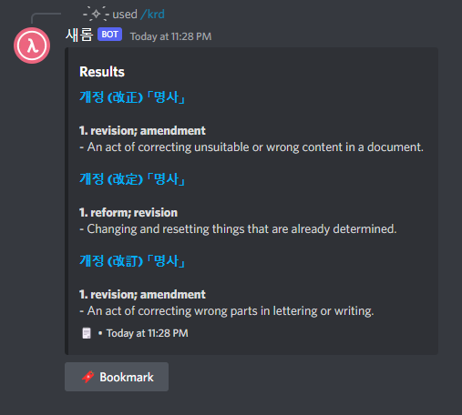
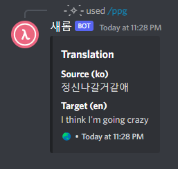

# saerom


[](https://github.com/jdeokkim/saerom/releases)
[](https://github.com/jdeokkim/saerom)
[](https://github.com/jdeokkim/saerom/blob/main/LICENSE)

A C99 Discord bot for Korean learning servers.

## Commands

| Name    | Description                                                                                                                                  |
| ------- | ---------------------------------------------------------------------------------------------------------------------------------------------|
| `/info` | Show information about this bot                                                                                                              |
| `/krd`  | Search the given text in the dictionaries ("Basic Korean Dictionary" & "Urimalsaem") published by the National Institute of Korean Language  |
| `/ppg`  | Translate the given text between two languages using [NAVER™ Papago NMT API](https://developers.naver.com/docs/papago/README.md)             |

## Screenshots

### `/info`

<details>
  <summary>Screenshot</summary>

    
</details>

### `/krd`

<details>
  <summary>Screenshot</summary>

   
</details>

### `/ppg`

<details>
  <summary>Screenshot</summary>

    
</details>

## Prerequisites

- GCC version 9.4.0+
- GNU Make version 4.1+
- CMake version 3.10.0+
- Git version 2.17.1+
- libcurl4 version 7.58.0+ (with OpenSSL flavor)

```console
$ sudo apt install build-essential cmake git libcurl4-openssl-dev
```

## Building

This project uses [GNU Make](https://www.gnu.org/software/make) as the build system.

1. Install the latest version of [Cogmasters/concord](https://github.com/Cogmasters/concord) from the `dev` branch.

```console
$ git clone https://github.com/Cogmasters/concord && cd concord
$ git checkout dev && make -j`nproc`
$ sudo make install
```

2. Then, install the latest version of [boundary/sigar](https://github.com/boundary/sigar).

```console
$ git clone https://github.com/boundary/sigar && cd sigar 
$ mkdir build && cd build
$ cmake .. && make -j`nproc`
$ sudo make install
$ ldconfig
```

3. Build this project with the following commands.

```console
$ git clone https://github.com/jdeokkim/saerom && cd saerom
$ make
```

4. Configure and run the bot.

```console
$ vim res/config.json
$ ./bin/saerom
```

## License

GNU General Public License, version 3